# League AI Video Editor — Architecture & Design Document

## Table of Contents

1. [Project Overview](#project-overview)
2. [Research Foundation: CS224R "Garen-teed Not a Bot"](#research-foundation)
3. [Where We Follow the Paper vs. Where We Diverge](#follow-vs-diverge)
4. [Machine Learning Concepts Used](#ml-concepts)
5. [Design Decisions and Rationale](#design-decisions)
6. [System Architecture](#system-architecture)
7. [Extraction Pipeline Deep Dive](#extraction-pipeline)
8. [What We've Built So Far](#current-state)

---

## 1. Project Overview <a name="project-overview"></a>

League AI Video Editor is a coaching analysis platform for League of Legends. A user uploads a gameplay clip, and the system extracts structured game-state data (CS, gold, KDA, HP, abilities, minimap positions) using computer vision and OCR, then uses that **grounded evidence** to generate coaching feedback — rather than having an LLM hallucinate game events from raw frames.

The core insight: **don't ask an LLM to "watch" gameplay. Extract the data deterministically, then give the LLM structured evidence to reason about.**

---

## 2. Research Foundation <a name="research-foundation"></a>

### CS224R: "Garen-teed Not a Bot" — Stanford Deep Reinforcement Learning

**Paper link:** [CS224R Project Final Paper — Garen-teed Not a Bot](https://cs224r.stanford.edu/projects/pdfs/CS224R_Project_Final_Paper-4.pdf)

**Course:** [Stanford CS224R — Deep Reinforcement Learning](https://cs224r.stanford.edu/)

This paper from Stanford's CS224R course (Deep Reinforcement Learning) built a real-time League of Legends agent. The key techniques from the paper and the broader CS224R curriculum:

### Key ML Concepts from the Paper

**Screen Capture → Feature Extraction Pipeline**
The paper captured the game screen at regular intervals and passed frames through a YOLOv3 object detection network to extract salient feature vectors. This is the foundational idea we adapted — treating the game screen as a computer vision problem.

**Behavioral Cloning / Imitation Learning**
Rather than learning from scratch via RL exploration (which is intractable in a game as complex as League), the paper used demonstrations from human players to learn policy. The agent observed what good players did and learned to imitate their decisions. CS224R covers this as "learning from demonstrations."

**Reinforcement Learning (PPO + LSTM)**
The paper used Proximal Policy Optimization (PPO) combined with Long Short-Term Memory (LSTM) networks. PPO is a policy gradient method that constrains how much the policy can change per update (preventing catastrophic updates). LSTM handles the temporal dimension — League is sequential, and what happened 10 seconds ago matters for the current decision.

**Feature Engineering from Game State**
Rather than feeding raw pixels into a model, the paper extracted structured features: champion positions, health percentages, cooldown states, minion positions, gold totals. This dramatically reduces the dimensionality of the problem.

**Reward Shaping**
The paper defined proxy rewards (gold earned, CS count, damage dealt, objectives taken) rather than just win/loss, enabling denser learning signal.

### Related Work We Drew From

- **[Deep Learning Bot for League of Legends](https://ojs.aaai.org/index.php/AIIDE/article/view/7449)** (AAAI AIIDE) — Used YOLOv3 for screen capture feature extraction + LSTM for sequential decision making
- **[League-OCR-HUD](https://github.com/Dan-Shields/League-OCR-HUD)** and **[LeagueOCR](https://github.com/floh22/LeagueOCR)** — OCR-based data scraping from League HUD elements
- **[TLoL Scraper](https://github.com/MiscellaneousStuff/tlol-scraper)** — Dataset extraction from League replays for deep learning
- **[TFT-OCR-BOT](https://github.com/jfd02/TFT-OCR-BOT)** — OCR-driven bot for Teamfight Tactics demonstrating deterministic game state extraction from screen captures

---

## 3. Where We Follow the Paper vs. Where We Diverge <a name="follow-vs-diverge"></a>

### What We Took from the Paper

| Concept | Paper's Approach | Our Adaptation |
|---------|-----------------|----------------|
| **Screen capture → features** | YOLOv3 on live game screen | OpenCV frame sampling + Tesseract OCR on recorded VODs |
| **Deterministic feature extraction** | Object detection for champions/minions | Crop-based OCR for HUD elements (CS, gold, KDA, HP, timer) |
| **Temporal feature sequences** | LSTM over game state vectors | Time-series of extracted features stored per-frame in DB |
| **Behavioral cloning dataset** | Recording human gameplay | Pro VOD dataset pipeline (Phase 3) |
| **Derived micro features** | HP deltas, gold rates, positioning | HP delta, CS/min rate, gold delta, spacing proxy |
| **Segment detection** | Episode boundaries for RL | Rule-based fight/death/objective window detection |

### Where We Diverge

| Aspect | Paper | Our System | Why |
|--------|-------|-----------|-----|
| **Goal** | Play the game autonomously (RL agent) | Analyze and coach after the fact | Different product — coaching, not botting |
| **Input** | Live game screen at runtime | Recorded VODs uploaded by users | Web-based SaaS, not a game client overlay |
| **Detection model** | YOLOv3 (trained on League sprites) | Tesseract OCR on fixed HUD regions (Phase 1), YOLOv8n ONNX (Phase 1.5) | No labeled League detection dataset yet; OCR is deterministic and works immediately |
| **Learning algorithm** | PPO + LSTM for action policy | GRU classifier for segment tagging (Phase 2), retrieval-based coaching (Phase 2) | We classify "what happened" rather than "what to do next" |
| **Compute** | GPU cluster for RL training | Single Windows dev box, CPU-only | MVP constraint; ONNX Runtime for inference is CPU-friendly |
| **Data source** | Live game memory/API | Post-game video files | No game client dependency; works with any recorded footage |
| **Reward signal** | Win/loss + proxy rewards | Manual labels + rule-based tags | No interactive environment; supervised learning paradigm |

### Key Insight

The paper built an **agent that acts**. We're building a **system that understands and explains**. The feature extraction pipeline is nearly identical — the difference is what happens downstream. Instead of feeding features into a policy network, we feed them into:
1. A segmenter (rule-based → learned) that identifies meaningful game moments
2. A report builder that gives an LLM structured evidence to reason about
3. Eventually, a retrieval system that finds similar pro plays for comparison

---

## 4. Machine Learning Concepts Used <a name="ml-concepts"></a>

### Phase 1 (Current): Deterministic Extraction

**Optical Character Recognition (OCR)**
We use Tesseract OCR with adaptive preprocessing to read text from fixed HUD regions. League's UI places stats at known screen positions, making deterministic cropping + OCR highly effective. Preprocessing includes:
- Grayscale conversion
- 2x bicubic upscaling (small HUD text needs more pixels)
- Adaptive Gaussian thresholding (handles variable game backgrounds)
- Character whitelisting (e.g., digits-only for gold/CS fields)

**Computer Vision — Deterministic Cropping**
Rather than running a full object detector, we exploit the fact that League's HUD is at fixed screen positions. Crop regions are defined as pixel coordinates for 1080p and scaled proportionally for other resolutions. This is a form of **domain-specific prior** — we know exactly where to look.

**Feature Engineering**
Derived features computed between consecutive frames:
- `hp_delta`: Change in HP percentage (proxy for damage taken/dealt)
- `cs_delta`: Change in CS count normalized to CS/min (farming efficiency)
- `gold_delta`: Gold income between frames
- `spacing_proxy`: (Future) Minimap position analysis for positioning quality

**Rule-Based Segmentation**
Time-series segmentation using handcrafted heuristics:
- Fight detection: sustained `hp_delta` spikes above threshold for >2 seconds
- Death detection: HP drops to 0 with previous frame having HP > 0
- (Future) Recall, roam, objective detection

### Phase 1.5: Object Detection (Complete)

**YOLOv8n via ONNX Runtime**
A YOLOv8 nano model fine-tuned on League of Legends gameplay and running on CPU via ONNX Runtime. Detects 16 classes:
- **Champions:** `played_champion`, `enemy_champion`, `freindly_champion` (sic — dataset spelling)
- **Minions:** enemy/friendly melee, ranged, cannon, super minions
- **Structures:** enemy/friendly towers, inhibitors, nexus

**Training details:**
- Dataset: vasyz's "LeagueOfLegends" Roboflow dataset (v4, 435 images, CC BY 4.0)
- Transfer learning from COCO-pretrained YOLOv8n, fine-tuned for 50 epochs at 640px
- Results: mAP50 = 0.845, mAP50-95 = 0.614
- Strong per-class: played_champion (0.995 mAP50), friendly_tower (0.995), enemy_tower (0.955)
- Model exported to ONNX (11.7 MB), inference ~43ms/frame on CPU
- Auto-enabled: detector activates when `data/models/yolov8n_lol.onnx` exists

This is the same approach as the CS224R paper (YOLOv3) but using a newer, more efficient architecture. See `docs/yolo-detection-guide.md` for full details.

### Phase 2A (Current): Champion Identification + Detection Polish

**HUD Portrait Matching + User Input**
YOLO detects generic classes (`played_champion`, `enemy_champion`) but doesn't know *which* champion. Phase 2A adds champion-specific identification:

1. **User-specified player champion** — the user types their champion name before extraction. This gives 100% accuracy for the player's own champion.
2. **Auto-matching for allies** — the system extracts 4 ally portrait crops from above the minimap and matches them against Riot's Data Dragon champion icons using HSV color histogram comparison. Accuracy is ~50% because skins change appearance.
3. **Icons-only mode** (default) — Only loads the ~172 default champion icons as references, NOT the 2054 skin loading screen images. Skin images are face crops from full-body loading screens that look nothing like the small circular HUD portraits. Using them caused massive noise (everything matched "Briar").

**Health Bar Color Correction**
YOLO often confuses ally vs enemy. We use health bar color as ground truth — League uses three distinct colors:
- **Dark green (H 35-95)** = the player's own character
- **Blue/cyan (H 95-130)** = ally teammates
- **Red (H 0-10, 170-180)** = enemies

For each YOLO detection, we crop the pixels above the bounding box, convert to HSV, and count green/blue/red pixels. This overrides YOLO's guess with ground truth. Additionally enforces max 1 `played_champion` per frame.

**IoU Object Tracker**
Without temporal consistency, detection boxes flicker between frames and class labels flip randomly. The tracker provides:
- **IoU matching** between frames (threshold 0.3) — same object gets the same track ID
- **EMA bbox smoothing** (alpha 0.4) — boxes glide instead of jumping
- **Majority-vote class labels** over 10-frame history — prevents single-frame misclassifications
- **Champion identity preservation** — once a track is labeled "Rengar", it stays "Rengar"

**Key limitation discovered:** Template/histogram matching fundamentally cannot handle skin variants. Future work: train a CNN embedding classifier on cropped YOLO bounding boxes.

### Phase 2: Lightweight Learning

**Retrieval-Augmented Coaching (No Training Required)**
- Embed segment keyframes using OpenCLIP (pretrained vision-language model)
- Store embeddings in the database (pgvector extension or FLOAT arrays)
- At query time: embed the user's segment, find K-nearest pro exemplars
- Output: "Your trade at 0:23 is similar to [Ruler's trade in Game X]"
- This is **zero-shot transfer** — no League-specific training needed

**GRU Segment Classifier (Minimal Training)**
- Architecture: 1-layer Gated Recurrent Unit (hidden_dim=64) → linear classification head
- Input: Time-series of extracted features per segment (hp_delta, cs_delta, gold_delta, ...)
- Output: Micro tags — "good_trade", "bad_trade", "missed_cs", "good_roam", "overextend"
- Why GRU over LSTM: Fewer parameters, faster training, comparable performance on short sequences
- Training data: Rule-based labels from Phase 1 + manual corrections
- Training time: <1 hour on CPU for small dataset
- Export to ONNX for inference

### Phase 3: Pro VOD Data Pipeline

**Behavioral Cloning Dataset**
- Ingest pro player VODs (YouTube, Twitch archives, tournament broadcasts)
- Run the same extraction pipeline on pro footage
- Build a labeled dataset of "what pros do" in various situations
- This is the **expert demonstration dataset** from imitation learning

**Contrastive Learning (Future)**
- Learn embeddings where similar game states cluster together
- "This 2v2 trade in gold elo" vs "This 2v2 trade in pro play" → measurable difference
- Enables quantitative comparison between user play and pro play

### Phase 4: Scaled Inference

**Model Serving**
- All inference models exported to ONNX format
- ONNX Runtime handles CPU/GPU dispatch automatically
- Batch inference for high throughput
- Model versioning tracked in database

---

## 5. Design Decisions and Rationale <a name="design-decisions"></a>

### Why PostgreSQL (Supabase) over MongoDB?

| Criterion | PostgreSQL | MongoDB | Winner |
|-----------|-----------|---------|--------|
| **Structured queries** | Native SQL, powerful JOINs across frames/segments/videos | Aggregation pipeline, less intuitive for relational queries | PostgreSQL |
| **JSONB support** | First-class JSONB with GIN indexes — best of both worlds | Native JSON, but everything is JSON | Tie |
| **Time-series queries** | Efficient range scans with B-tree indexes on `timestamp_ms` | Requires careful index design | PostgreSQL |
| **Concurrent writes** | MVCC handles concurrent frame inserts well | Better raw write throughput, but we batch-insert | PostgreSQL |
| **Vector search** | pgvector extension for embedding similarity | Requires Atlas Vector Search (paid) | PostgreSQL |
| **Schema enforcement** | CHECK constraints catch bad data early (e.g., `end_ms > start_ms`) | Schema-free means bugs hide longer | PostgreSQL |
| **Ecosystem** | Supabase gives us auth, realtime, storage, edge functions for free | Need to build all infrastructure separately | PostgreSQL |
| **Scale path** | Supabase handles managed scaling, read replicas, connection pooling | Atlas handles scaling, but more expensive at scale | PostgreSQL |

**The decisive factor:** We have **relational data** (a video has many frames, frames belong to jobs, segments reference frames, reports reference segments). SQL handles this naturally. The JSONB columns give us MongoDB's flexibility for the parts that are genuinely schemaless (OCR data varies by what we can detect, detection outputs vary by model version).

Supabase specifically because:
- Managed Postgres — no ops burden
- Built-in auth (needed for multi-user in Phase 4)
- Realtime subscriptions (live extraction progress without polling)
- Edge Functions (move inference closer to users)
- Row Level Security (users only see their own videos)
- pgvector support (embedding search in Phase 2)

### Why asyncpg over SQLAlchemy ORM?

- Raw SQL is simpler and more transparent for this project
- asyncpg is the fastest Python Postgres driver (~3x faster than psycopg2)
- No ORM abstraction means we control exactly what queries run
- Batch inserts via `executemany` are straightforward
- Less magic = easier debugging

### Why Tesseract OCR over Cloud Vision API?

- **Free and local** — no API costs, no latency, no rate limits
- **Deterministic** — same input always produces same output
- **Privacy** — user gameplay never leaves the server
- **Fast enough** — ~50ms per small crop region on CPU
- Cloud Vision is more accurate but would add cost/latency/dependency at scale

### Why BackgroundTask over Celery/Redis?

- MVP simplicity — no extra infrastructure
- Python's `asyncio.to_thread` offloads CPU-bound work properly
- For Phase 4 scale, we'd move to a proper task queue (Supabase Edge Functions, or Celery + Redis)
- Current approach handles single-user dev workflow perfectly

### Why Evidence-Grounded Reports over Raw Frame Analysis?

The original MVP sent raw video frames to Claude and asked "what do you see?" This causes:
1. **Hallucination** — LLM "sees" events that didn't happen
2. **No citation** — can't verify any claim against data
3. **Expensive** — sending 12 images per request costs ~$0.05+ per analysis
4. **Inconsistent** — same video gets different analysis each time

The new approach:
1. Extract data **deterministically** (OCR reads "CS: 156" — that's a fact)
2. Send **structured text** to Claude (cheap, fast, consistent)
3. Claude reasons about **evidence** ("CS went from 140 to 156 in 2 minutes = 8 CS/min")
4. Every claim can be **traced back** to a specific frame and field

---

## 6. System Architecture <a name="system-architecture"></a>

### Current Architecture (Phase 1)

```
Browser (React + Vite)
    │
    │  HTTP/SSE
    ▼
FastAPI (Python 3.13)
    ├── Legacy endpoints (/api/v1/video, /analyze)
    │     └── Direct frame → Claude vision (old flow)
    │
    ├── New endpoints (/api/v1/videos, /extract, /frames, /segments, /report)
    │     ├── Upload → Postgres + local disk
    │     ├── Extract → BackgroundTask pipeline
    │     │     ├── OpenCV frame sampling (5 fps)
    │     │     ├── Deterministic HUD cropping + OCR
    │     │     ├── YOLO detection (16 classes)
    │     │     ├── Health bar color correction (green/blue/red)
    │     │     ├── Object tracking (IoU + EMA smoothing)
    │     │     ├── Champion labeling
    │     │     ├── Feature computation (deltas)
    │     │     ├── Rule-based segmentation
    │     │     └── Batch insert to Postgres
    │     ├── Report → Evidence prompt → Claude → SSE stream
    │     └── Labels → Manual annotation endpoint
    │
    └── Database (PostgreSQL 16)
          ├── videos
          ├── analysis_jobs
          ├── frame_payloads (JSONB)
          ├── segments
          ├── labels
          └── reports
```

### Target Architecture (Phase 4)

```
CDN (Cloudflare)
    │
    ▼
Load Balancer
    │
    ├── Web Servers (N instances)
    │     └── FastAPI / Supabase Edge Functions
    │
    ├── Task Queue (Redis / Supabase Queues)
    │     └── Extraction Workers (N instances, GPU optional)
    │           ├── Frame sampling
    │           ├── OCR pipeline
    │           ├── YOLO detection (ONNX, GPU)
    │           ├── GRU segment classifier (ONNX)
    │           └── Embedding computation (OpenCLIP)
    │
    ├── Supabase (Managed Postgres)
    │     ├── All tables + pgvector
    │     ├── Row Level Security
    │     ├── Realtime subscriptions
    │     └── Auth (email, OAuth)
    │
    ├── Object Storage (Supabase Storage / R2)
    │     ├── Videos
    │     ├── Frames
    │     └── Model artifacts
    │
    └── Model Registry
          ├── OCR models (Tesseract / custom)
          ├── YOLO detector (ONNX)
          ├── GRU classifier (ONNX)
          └── Embedding model (OpenCLIP ONNX)
```

---

## 7. Extraction Pipeline Deep Dive <a name="extraction-pipeline"></a>

### How It Works — The Plain English Version

When you click "Extract Game Data", here's what happens to your video, one frame at a time:

```mermaid
flowchart TD
    A["🎬 Your Video File"] --> B["1. Frame Sampler"]
    B -->|"5 frames/sec<br/>(not all 30+)"| C["2. HUD Cropper"]
    B -->|"same frame"| D["3. YOLO Detector"]

    C --> E["OCR Engine<br/>(reads text from HUD)"]
    D --> F["4. Health Bar Color Check<br/>(green/blue/red = who?)"]
    F --> G["5. Object Tracker<br/>(smooth + stabilize)"]
    G --> H["6. Champion Labeling"]

    E --> I["7. Feature Math<br/>(HP deltas, CS/min, etc.)"]
    H --> I
    I --> J["8. Save to Database"]
    J --> K["9. Segment Detection<br/>(fights, deaths)"]
    K --> L["✅ Done — UI updates"]
```



### Step-by-Step Walkthrough

**Step 1 — Frame Sampling** (`extractor/sampler.py`)

Your video is 30+ fps, but we don't need every frame. We sample at 5 fps (configurable), giving us one frame every 200ms. A 20-second clip → ~100 frames instead of 600. OpenCV reads frames one at a time — the full video is never loaded into memory.

**Step 2 — HUD Cropping + OCR** (`extractor/cropper.py`, `extractor/ocr.py`)

League's HUD is always in the same place on screen. We know exactly where the CS counter, KDA, game timer, etc. live (calibrated for 1080p Outplayed recordings). We crop those tiny rectangles and run Tesseract OCR on each one to read the text. This is the "deterministic" part — no ML model guessing, just reading pixels.

**Step 3 — YOLO Object Detection** (`extractor/detector.py`)

This is the ML part. YOLO (You Only Look Once) is a neural network that looks at the full frame and draws bounding boxes around things it recognizes. Our model knows 16 classes: champions (player/ally/enemy), minions (melee/ranged/cannon/super × ally/enemy), and structures (tower/inhibitor/nexus × ally/enemy).

How YOLO works in ~30 seconds:
- The image gets resized to 640×640 and fed through the neural network
- The network outputs thousands of candidate boxes, each with a class probability
- Non-Maximum Suppression (NMS) filters overlapping boxes — keeps only the best one per object
- Result: a list of `{class_name, confidence, bbox}` per detected entity

The model is a `.onnx` file (11.7 MB) that runs on CPU via ONNX Runtime. No GPU needed.

**Step 4 — Health Bar Color Correction** (`extractor/postprocess.py`)

YOLO is good at finding champions/minions but often guesses wrong about ally vs enemy. This step looks at the health bar above each detection to override YOLO's guess:

```
League health bar colors (these are ground truth):
┌──────────┬────────────────────┬─────────────┐
│  Color   │  Meaning           │  HSV Hue    │
├──────────┼────────────────────┼─────────────┤
│  Green   │  YOU (the player)  │  H 35-95    │
│  Blue    │  Your allies       │  H 95-130   │
│  Red     │  Enemies           │  H 0-10,    │
│          │                    │  170-180    │
└──────────┴────────────────────┴─────────────┘
```

For each detection, we crop the pixels just above the bounding box (where the health bar is), convert to HSV color space, and count how many pixels are green vs blue vs red. The dominant color wins. This is simple but powerful — a green health bar means it's definitively the player, regardless of what YOLO guessed.

After color correction, we enforce: **max 1 `played_champion` per frame**. If multiple detections got labeled as the player (shouldn't happen but YOLO is imperfect), we keep the highest-confidence one and demote the rest to `freindly_champion`.

**Step 5 — Object Tracker** (`extractor/tracker.py`)

Without tracking, bounding boxes appear independently each frame — they flicker, jump around, and the same champion might be labeled "player" one frame and "ally" the next. The tracker adds temporal consistency:

```mermaid
flowchart LR
    subgraph "Frame N"
        A1["Det A: ally @ (100,200)"]
        B1["Det B: player @ (500,300)"]
    end

    subgraph "Frame N+1"
        A2["Det X: ally @ (105,205)"]
        B2["Det Y: enemy @ (510,310)"]
    end

    subgraph "Tracker Logic"
        M["IoU Matching:<br/>A↔X overlap 0.85 ✓<br/>B↔Y overlap 0.78 ✓"]
        S["Smooth bbox:<br/>new = 0.4×detected + 0.6×previous"]
        V["Class vote:<br/>B was 'player' 8/10 frames<br/>→ stays 'player' despite<br/>this frame saying 'enemy'"]
    end

    A1 & A2 --> M
    B1 & B2 --> M
    M --> S --> V
```



How it works:
1. **IoU matching** — For each new detection, compute overlap (Intersection over Union) with every existing track. If IoU ≥ 0.3, it's the same object. Greedy assignment (best matches first).
2. **Bbox smoothing** — Instead of jumping to the new position, blend: `smoothed = 0.4 × new + 0.6 × old`. This makes boxes glide instead of teleport.
3. **Class majority vote** — Keep the last 10 class labels per track. The most common one wins. So if YOLO says "player, player, player, ally, player, player…" the output stays "player."
4. **Champion memory** — Once a track is identified as "Rengar", it stays "Rengar" even if one frame fails to match.
5. **Track lifecycle** — New objects get a new track. Objects that vanish for >3 frames get deleted.

**Step 6 — Champion Labeling** (`extractor/champion_id.py`, `pipeline.py`)

On the first frame, we figure out who's who:
- **Player**: If you typed "Rengar" in the form → confidence 1.0, definitive. If not, we auto-detect from the HUD portrait using icon matching (~172 champion icons compared via HSV histograms).
- **Allies**: Auto-detected from the 4 small portraits above the minimap. Accuracy is mediocre (~50%) because skins change appearance drastically. We use `icons_only=True` to avoid noise from skin loading screen images.
- **Enemies**: Just labeled "Enemy" — can't identify them from our camera angle.

The champion name gets attached to `played_champion` detections, and the tracker preserves it across all subsequent frames.

**Steps 7-9 — Features, DB, Segmentation**

Standard data processing:
- Compute derived features between consecutive frames (HP change, CS rate, gold income)
- Batch insert into PostgreSQL (20 frames at a time for efficiency)
- Run segment detection on the full sequence — finds fights (sustained HP drops), deaths (HP → 0), etc.

### Pipeline Stages — Quick Reference

```
Video File (MP4/WebM)
    │
    ▼
[1] Frame Sampler ────── 5 fps, max 600 frames
    │                     OpenCV VideoCapture, seek by frame index
    ▼
[2] HUD Cropper ──────── 12 crop regions for 1080p
    │                      (timer, KDA, CS, HP, level, items, etc.)
    ▼
[3] OCR Engine ────────── Tesseract + field-specific preprocessing
    ▼
[4] YOLO Detector ─────── YOLOv8n ONNX, 16 classes, ~43ms/frame
    ▼
[5] Health Bar Color ──── 3-color reclassification (green/blue/red)
    │                      + max-1-player enforcement
    ▼
[6] Object Tracker ────── IoU matching + EMA smoothing + class vote
    │                      (prevents flickering between frames)
    ▼
[7] Champion Labeler ──── User-specified name → played_champion
    │                      Auto-match icons → allies
    ▼
[8] Feature Computer ──── HP delta, CS/min, gold delta
    ▼
[9] DB Insert ─────────── Batch 20 frames, progress updates
    ▼
[10] Segmenter ────────── Rule-based fight/death detection
    ▼
[11] Job Complete ─────── Frontend gets notified
```

### Resource Controls

- **Memory**: OpenCV seeks frame-by-frame, never loads full video
- **CPU**: Pipeline runs in `asyncio.to_thread`, doesn't block event loop
- **DB**: Batch inserts (20 frames/batch) reduce round trips
- **Disk**: Crop images only saved when debug mode enabled
- **Frames**: 5 fps default = 100 frames for 20s video (not 600 at 30fps)
- **Max cap**: 600 frames per extraction (configurable)

---

## 8. What We've Built So Far <a name="current-state"></a>

### Completed (Phase 1 — Core Pipeline)

- [x] Docker Compose with PostgreSQL 16 + pgAdmin
- [x] Database schema: 6 tables with indexes and constraints
- [x] Migration runner (simple SQL file execution with tracking)
- [x] asyncpg connection pool with lifespan management
- [x] Typed query functions for all tables
- [x] Pydantic schemas for all API models
- [x] Local disk storage abstraction (S3-ready interface)
- [x] Frame sampler (OpenCV, configurable FPS)
- [x] Deterministic HUD cropper (9 regions, resolution-aware)
- [x] Tesseract OCR pipeline with field-specific preprocessing
- [x] Feature computer (HP/CS/gold deltas)
- [x] Rule-based segmenter (fight + death detection)
- [x] YOLO detector (YOLOv8n ONNX, 16 classes, mAP50=0.845)
- [x] Pipeline orchestrator with BackgroundTask execution
- [x] All API routers: videos, extraction, reports, labels
- [x] Evidence-grounded report builder + Claude integration
- [x] Frontend: mode toggle, VideoUploader, ExtractionStatus, FrameTimeline, SegmentList, ReportView
- [x] Typed API client
- [x] Legacy endpoint backward compatibility
- [x] OCR debugging script (`scripts/test_ocr.py`)

### Completed (Phase 1.5 — YOLO Detection)

- [x] YOLOv8n trained on vasyz Roboflow dataset (435 images, 16 classes)
- [x] ONNX model exported to `data/models/yolov8n_lol.onnx` (11.7 MB)
- [x] Detector postprocessing: decode tensor, NMS, scale boxes to frame coords
- [x] Pipeline auto-enables detector when model file exists
- [x] Frontend overlay draws detection boxes (color-coded by class)
- [x] Training script at `scripts/train_yolo.py` for reproducibility
- [x] Documentation at `docs/yolo-detection-guide.md`

### Completed (Phase 2A — Champion Identification + Detection Polish)

- [x] Data Dragon icon downloader (172 icons + 2054 skin loading screens)
- [x] ChampionIdentifier module with HSV histogram matching against HUD portraits
- [x] **Icons-only mode** (default) — skips 2000+ skin images that caused false matches
- [x] Player portrait (bottom-center HUD) and 4 ally portraits (above minimap) calibrated for 1080p
- [x] User-specified `played_champion` input field in frontend + API + pipeline
- [x] YOLO detection labels enriched with champion names (e.g., "You: Rengar 92%" instead of "played_champion 53%")
- [x] **3-color health bar correction** — green (player) / blue (allies) / red (enemies), calibrated from real frames
- [x] **IoU object tracker** — EMA bbox smoothing + majority-vote class stabilization across frames
- [x] Max-1-player enforcement per frame
- [x] Calibration debug tool (`scripts/calibrate_scoreboard.py`)
- [x] Health bar color debug tool (`scripts/debug_health_bar_colors.py`)

### Not Yet Built

- [ ] OCR calibration with more League screenshots (different resolutions)
- [ ] OpenCLIP embedding pipeline
- [ ] GRU segment classifier
- [ ] Pro VOD ingestion pipeline
- [ ] Supabase migration (from local Docker Postgres)
- [ ] Authentication / multi-user
- [ ] Horizontal scaling
- [ ] Frontend polish (debug overlays, frame scrubbing, label UI)

---

*Last updated: February 2026*
*Project repository: League_AI_Video_Editor*
